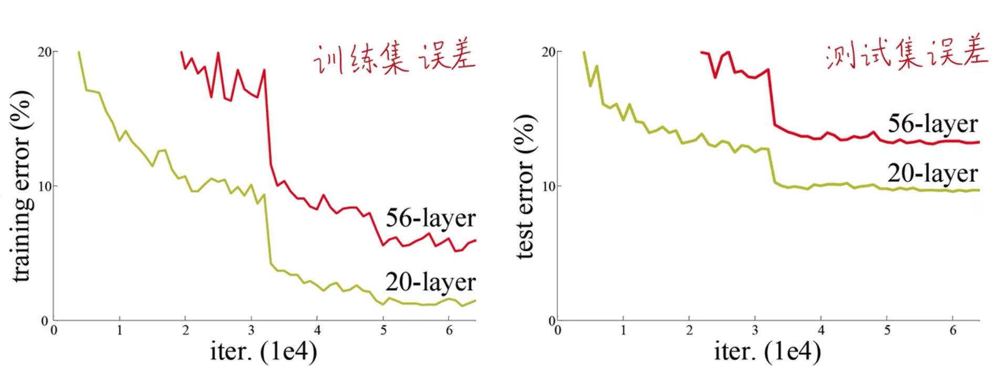
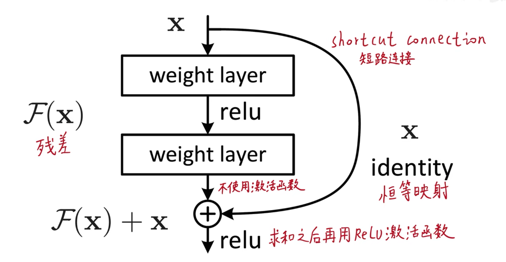
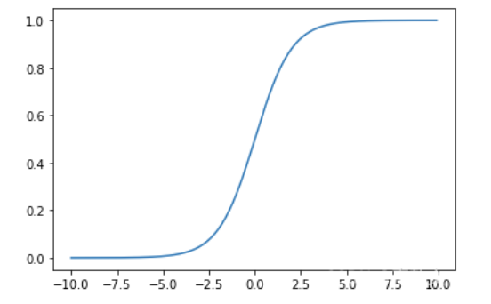
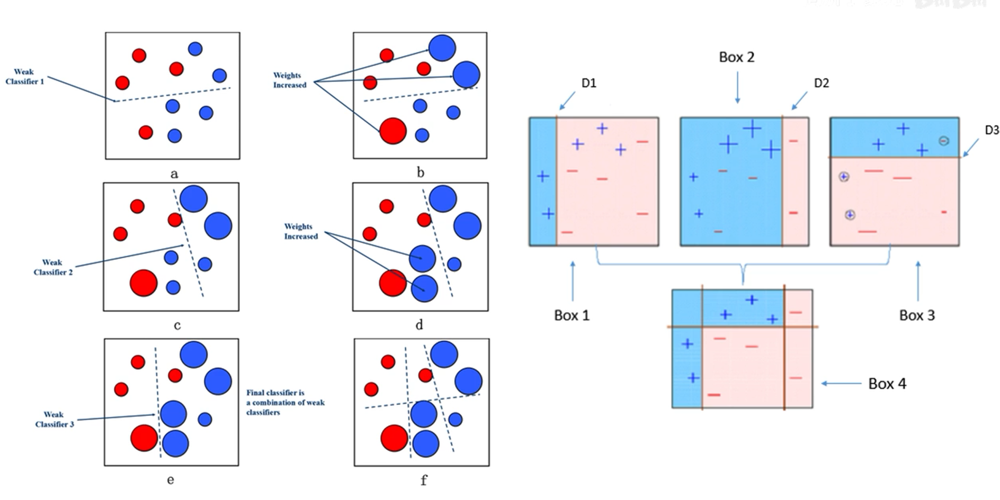

# 写在前面 
本文结合视频[【精读AI论文】ResNet深度残差网络](https://www.bilibili.com/video/BV1vb4y1k7BV?spm_id_from=333.788.videopod.episodes&vd_source=d82de55cfde970cdf86016bef2c6de4e&p=3)做一些记录和理解。   
# ResNet简介  
在ResNet之前，网络层数的加深，会导致准确率下降。  
  
这种准确率降低与过拟合的区别在于，网络的训练误差和测试误差随着网络深度加深是同时增加的，而过拟合的典型表现是训练误差减小，但测试误差上升。  
  
# 残差块
  
残差块对于输出的计算：  
1. 原封不懂保留输入$x$   
2. 通过一系列的矩阵运算，得到$F(x)$  
3. 将以上两者加起来得到输出$F(x)+x$

这样一来在训练过程中，实际上调整参数拟合的是$F(x)$，一种比较粗糙的理解就是即使网络学习不到任何东西，也可以保证输出=输入，效果不会更差。  

# 残差块提升效果的原因
1. 首先也许是能够解决梯度消失的问题。  
需要首先了解什么是**梯度消失**。在神经网络使用sigmoid作为激活函数的时候，往往就会容易发生梯度消失问题。根据sigmoid函数图像可以看出，图像的两端的梯度几乎为0，所以如果网络中某一层的输入分布到两端，那么这个时候梯度就非常接近0，导致无法继续训练。而ResNet由于存在恒等映射这一路的计算（即$y=F(x)+x$，所以永远存在梯度为1的这一路计算，可以防止梯度的消失。  
  
***但是在ResNet的原文当中，作者是做了试验，检查了深网络的梯度，发现并不存在梯度消失的问题，所以还有以下的一些解释：***  
2. 可能和boosting类似。
  
boosting是每次迭代训练弱学习器的过程，[提升方法(boosting)](/machine_learning/提升方法(boosting).md) 可以看作每次都是在拟合上一个弱学习器和ground truth之间的偏差。ResNet可能存在同样的ensemble的效果，从而提升了模型的效果。  

此外视频中还介绍了不少机理，都觉得比较有道理，毕竟都是一些发了论文的工作:laughing:，所以我这样一个小白来看肯定会觉得有道理:laughing:。  

