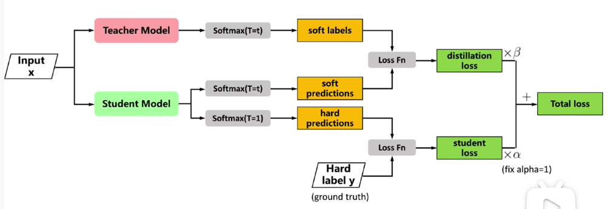

# 简介
知识蒸馏(knowledge distillation)是目前（2025.4.3）用来轻量化模型的一种手段。其开山之作是Hinton在2015年发表的论文《Distilling the Knowledge in a Neural Network》。本文结合视频[【精读AI论文】知识蒸馏](https://www.bilibili.com/video/BV1gS4y1k7vj/?spm_id_from=333.1007.top_right_bar_window_history.content.click&vd_source=d82de55cfde970cdf86016bef2c6de4e)做一些记录和理解。  

# hard label vs soft label
Hard label就是预训练时的人工标签，一般以目标类别为1，其他类别都为0。Hard label的问题在于其中不包括类别之间的相互关系，从这个角度上看，有一种标签更为合理，也就是soft label，soft label中，非正确类别的标签不为0，比如对于一张“马”的图片，其soft label可以为[0.7, 0.25, 0.05]，其中0.7表示“马”这个类别，0.25表示“斑马”，0.05表示“特斯拉”这个类别。而这样的soft label往往通过模型输出得到会比较合理，一个优秀的深度学习模型，应该是可以学习到“马”和“斑马”之间的相似性的，从而在它的输出之中会将这种相似性体现出来。  
而蒸馏正是将一个优秀的大模型的输出作为soft label，来训练一个轻量化的模型。可以理解为一种“老师”和“学生”的关系。  

# 蒸馏温度  
蒸馏温度T就是在常见的softmax上添加一个系数。  
$$
q_i = \frac{\exp(\frac{z_i}{T})}{\sum_j \exp(\frac{z_j}{T})}
$$  
系数T会使原来softmax的输出更加平滑，从而使得输出更加接近soft label。也就是在原来softmax输出中占比较小的概率值，在T增大时，其概率值也会增大，从而使得输出更加接近soft label。  
这个T在大语言模型中其实很常见，有一些语言模型的api就可以允许用户自行调节T值，从而使得大语言模型输出是更加保守（T值小）或是更加具有创造力（T值越大）。  

# 蒸馏具体过程  
   
其过程和正常训练一个神经网络是一样的。区别在于损失函数是通过将输出与soft label的交叉熵乘以系数$\beta$加上输出hard label的交叉熵乘以系数$\alpha$得到的。  
