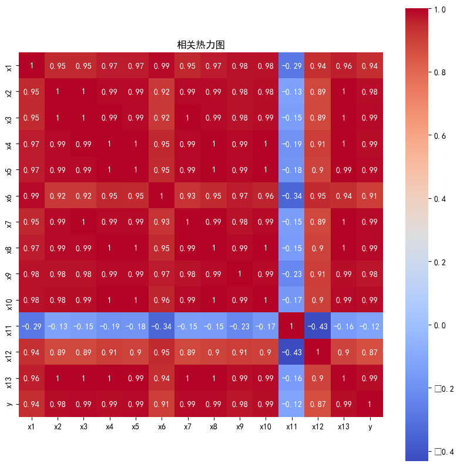

# Lasso回归  
Lasso回归是正则化方法的一种，是压缩估计，通过构造一个惩罚函数得到一个精炼的模型。如果看过《统计学习方法——李航》，应该对于统计学习（机器学习）中的正则化有所了解。其实Lasso就是该书中大量介绍的正则化方法，同时也是很多机器学习入门会提到的正则化方法。  
这个过程是通过优化一个“损失”+“惩罚”完成的。其参数估计定义式如下：  
$$ 
\hat{\beta}(Lasso)=argmin^2_{\beta}||y-\sum_{i=1}^{p}x_i\beta_i||^2+λ\sum^p_{i=1}|\beta_i|
$$
其中，  
$p$是参数个数；  
表达式的第一项是用L2范式表示的损失函数，真实值y和预测值之差的平方和再开平方，类似于标准差，描述了两者之间的差距。  
表达式的第二项是用L1范式表示的惩罚函数，描述了参数的稀疏性，即参数的绝对值之和。  

模型优化的过程实际上是找到使得上面的式子最小的参数。而由于罚项的存在，优化的过程既要使真实值和预测值差距最小，又要使参数绝对值之和最小，这就使得模型的参数稀疏化。***稀疏化的意思是很多参数为0.***   
我们思考一个过程，如果一个数据集中有n个特征，但是某些特征之间相关性很高，这些特征就叫**多重共线性特征**，考虑一个极端的情况，特征A和特征B的线性关系为$y=ax+b$，其中a=1，b=0，也就意味着特征B完全可以由特征A表示，那么多加入这一个特征就没有意义。而如果使用Lasso处理这些特征，就有可能使得特征B的参数为0，这样就可以剔除特征B，从而减少模型的复杂度，实现了特征的筛选。  

# 使用方法  
事实上很多机器学习的库实现的算法都内置了Lasso的实现，譬如[`sklearn.linear_model.LogisticRegression`](machine_learning/logistics.md)类就提供了参数`penalty`，默认为`l2`，也可以选择`l1`、`elasticnet`、`none`。  
但是有时候单独做lasso回归分析，也能帮我们认识和了解数据集的特征，Lasso回归分析本质上是一种特征选择（降维）的手段。  

## 案例描述
有一财政收入数据集如下：  

|         |x1       |x2      |x3      |x4      |x5      |x6      |x7      |x8      |x9      |x10     |x11     |x12     |x13     |y       |
|---------|--------|--------|--------|--------|--------|--------|--------|--------|--------|--------|--------|--------|--------|--------|
|0        |3831732 |181.54  |448.19  |7571.00 |6212.70 |6370241 |525.71  |985.31  |60.62   |65.66   |120.0   |1.029   |5321    |64.87   |
|1        |3913824 |214.63  |549.97  |9038.16 |7601.73 |6467115 |618.25  |1259.20 |73.46   |95.46   |113.5   |1.051   |6529    |99.75   |
|2        |3928907 |239.56  |686.44  |9905.31 |8092.82 |6560508 |638.94  |1468.06 |81.16   |81.16   |108.2   |1.064   |7008    |88.11   |
|3        |4282130 |261.58  |802.59  |10444.60|8767.98 |6664862 |656.58  |1678.12 |85.72   |91.70   |102.2   |1.092   |7694    |106.07  |
|4        |4453911 |283.14  |904.57  |11255.70|9422.33 |6741400 |758.83  |1893.52 |88.88   |114.61  |97.7    |1.200   |8027    |137.32  |

其中y为财政收入，x1-x13是可能影响财政收入的指标，比如社会从业人数、在岗职工工资总额等，这里不作具体介绍了。  

## 描述性分析
这种数据特征并不多的数据集，其实完全可以用简单的统计模型比如线性回归或者随机森林等。  
在利用数据建模之前，首先做数据的描述性统计，简单看看各特征之间的关系，Pearson相关性是非常常用的一种描述性分析，可以用来查看不同变量之间的相关性。 

```python 
import numpy as np
import pandas as pd 

import seaborn as sns

file_name = 'data.csv' 
df = pd.read_csv(file_name)

corr = df.corr(method='pearson')  
print('相关系数矩阵为：\n', np.round(corr,2))

sns.heatmap(corr, annot=True, cmap='coolwarm', vmax=1, square=True)
```
在pandas中执行Pearson相关性分析非常简单，只需要使用`DataFrame.corr()`方法就可以计算返回一个`DataFrame`对象。同时`seaborn`库的`heatmap`函数可以接收任何可以被强制解析成numpy的ndarray对象的2D数据对象并绘制热力图，传入`DataFrame`还能够将行列标签自动作为图的标签。  

就以上例子来说，得到的相关系数图如下：  
  
可以发现除了x11，大多数特征之间都存在很强的相关性（Pearson相关系数应该是反映线性相关关系），因此可以考虑使用Lasso回归进行特征的选择。  

## Lasso回归分析筛选特征
使用`sklearn.linear_model.Lasso`类对数据进行拟合。  
```python 
import numpy as np 
import pandas as pd 
from sklearn.linear_model import Lasso  

lasso = Lasso(alpha=1000) 
lasso.fit(df.iloc[:,0:13], df['y'])
```
这个类最重要的参数是`alpha`，代表惩罚项中的系数项。如果没有这个惩罚项系数，`Lasso`等价于`LinearRegression`类，也就是说，本质上sklearn中的Lasso是对数据进行一个带有惩罚项的线性拟合。  
> 对于大多数机器学习任务，使用带有正则化惩罚项的模型时，可以考虑通过交叉验证的方法调整这个alpha的系数值。  

那么如何使用Lasso进行特征选择呢？  
`Lasso`这个类对数据进行拟合之后，所有自变量的系数存放在`.coef_`这个属性中，这个属性返回的是一个ndarray。  

```python
print('相关系数为：', np.round(lasso.coef_, 5)) 

print('相关系数非零个数为：', np.sum(lasso.coef_ != 0))

>>> 相关系数为： [-1.8000e-04 -0.0000e+00  1.2414e-01 -1.0310e-02  6.5400e-02  1.2000e-04
  3.1741e-01  3.4900e-02 -0.0000e+00  0.0000e+00  0.0000e+00  0.0000e+00
 -4.0300e-02]
>>> 相关系数非零个数为： 8
```
通过Lasso得到的系数可以对进行自变量进行筛选，留下系数不为0的自变量。  
```python 
mask = lasso.coef_ != 0 
print('相关系数是否为零：', mask) 

new_data = df.iloc[:, mask] 
``` 
