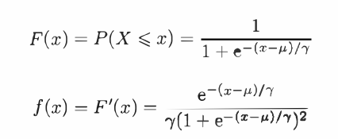
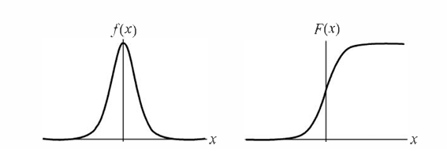

   # logistics
>本文主要为《统计学习方法——李航 第二版》的学习笔记。  

# logistics distribution 
随机变量X的分布函数和密度函数如下：  
  
其函数图像分别:  
  
右图是分布函数图像，其特点就是中间增长快，两边增长慢。该曲线实际上就是早期深度学习中经常用到的激活函数sigmoid。

# 二项逻辑斯蒂回归模型(binomial logistic regression model)
## 模型分布
$$
P(Y=1|x)=\frac{exp(w\cdot x+b)}{1+exp(w\cdot x+b)}  
$$
$$
P(Y=0|x)=\frac{1}{1+exp(w\cdot x+b)}
$$ 
从数据拟合的角度来看，binomial logistics似乎本质是线性回归模型，并且将拟合结果做了进一步的归一化。那么它与线性函数的函数是什么呢？

## 几率(odds)
一个事件发生与不发生的概率的比值叫做该事件的几率，即$\frac{p}{1-p}$，如果取对数得到对数几率（或者logit函数）：$log \frac{p}{1-p}$。  
所以如果对于binomial logistics的几率为：$log \frac{P(Y=1|x)}{P(Y=0|x)}=w \cdot x$。  

---
所以可以有两种对于该模型的理解：
- 在logistics模型中，Y=1的对数几率是输入x的线性函数。
- 存在一个将$x$进行分类的线性函数，通过logistics分布的将其转化为概率值。  

所以实际上拟合binomial logistics模型（估计模型参数）与线性回归本质上没有区别，常见的方法有最小二乘法和极大似然法。  

## 最小二乘法  
在线性回归中，最小二乘法是希望得到使得观察数据$y$和预测数据$\hat{y}=w \cdot x$之间的差异最小的$w$，通常用L1或者L2范数描述两者之间的差异，这个差异将是$w$的函数。  
这样就变成求差异函数的极小值。  

## 极大似然法  
使用极大似然估计logistics的思路是：训练集中的每个样本都是一个独立事件。根据logistics模型可以写出含有带估计参数的概率值，则联合概率（也就是所谓的似然函数）就是所有概率值的乘积。进而求似然函数的极大值。  

> 从计算机计算的角度来看，求极值可以一般可以用梯度下降法。  

## 使用sklearn实现逻辑回归
```python 
import numpy as np 
import sklearn.linear_model as lm 

x_features = np.array([[-1, -2], [-2, -1], [-3, -2], [1, 3], [2, 1], [3, 2]])
y_targets = np.array([0, 0, 0, 1, 1, 1]) 

lr_clf = lm.LogisticRegression()
lr_clf.fit(x_features, y_targets)

y = lr_clf.predict(np.array([[0, 1]]))
```
在sklearn库中的这个`LogisticRegression`类中，默认使用的是L2正则化，并且使用的是solver为`lbfgs`的优化算法。  
这个类有几个重要的参数需要理解一下：  
1. penalty：正则化项的类型，默认为`l2`，也可以选择`l1`、`elasticnet`、`none`。
   - 正则化项是在损失函数之后添加的一项，用于防止模型过拟合。
   - `l2`：L2正则化，也称为岭回归，它在损失函数中添加了权重的平方和的惩罚项，该项写为$\alpha ||w||_2=\alpha \sqrt{\sum_{i=1}^{n}{w_i^2}}$
   - `l1`：L1正则化，也称为Lasso回归，它在损失函数中添加了权重的绝对值的惩罚项，该项写为$\alpha ||w||_1=\alpha \sum_{i=1}^{n}{|w_i|}$
   - 为什么正则化能够防止过拟合，[文章](https://blog.csdn.net/zlrai5895/article/details/84947942)做了很详细的介绍。  
2. solver：优化算法的选择， {‘lbfgs’, ‘liblinear’, ‘newton-cg’, ‘newton-cholesky’, ‘sag’, ‘saga’}, 默认值为 ‘lbfgs’
3. max_iter：最大迭代次数，默认为100。