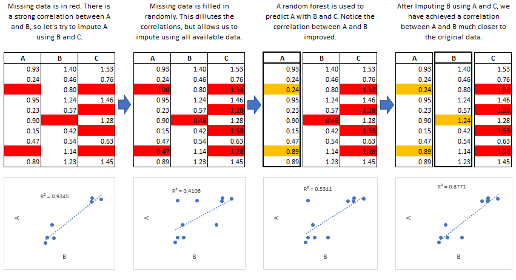
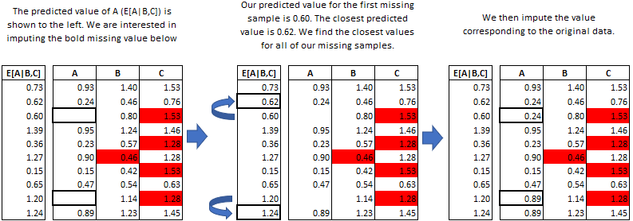

# 数据缺失：数据集中某些样本中存在部分的特征没有数据  
应对数据缺失的方法大致可以有删除和填补两种思路：
- 直接删除存在数据缺失情况的样本  
  > 如果不同的特征值缺失发生在不同的样本中，那么这种方法很容易会直接删除大量的样本
- 简单的使用平均值、众数等进行填充
  > 显然这种方式是比较粗糙的，并且很可能真真实值存在较大的差距。 
- 训练模型预测缺失值，将预测值作为填充

无论使用什么方法对数据进行**填补**，得到的数据本质上都是从已有的原始数据中计算出来的，因此和真实值之间肯定是存在偏差。而多重填补的思想则是通过多次平行地填补数据集，从而尽量减小这种偏差。具体的步骤为：(1)对缺失数据做多次的独立填补，得到多个数据集；(2)对填充好的多个数据集进行统计分析；(3)合并结果。

miceforest是python的一个使用快速多重插补的库，可以实现多重插补的链式方程式（MICE，multiple imputation by chained equation），官方文档提供的图片示例很好的展示了该算法的逻辑。  
  
上图展示的是一次迭代的过程，往往MICE中迭代次数在5次以上，以确保填补值平均值收敛。  
> - miceforest这个库默认使用的模型是lgbm（light gradient boost machine），作为一种boosting方法，lgbm实现了迭代训练一系列弱学习器（一般是决策树）的算法。
> - MICE方法中使用了一种叫*Predictive Mean Matching*（PMM）的方法来确定选择哪一个值进行填充。  
  
根据上图，通过LightGBM算法得到A特征的预测值之后，找到预测值与缺失值的预测值最为相近的非缺失值（candidates），在N个最接近的candidates中随机选择一个作为缺失值的填补值。  

使用这个库主要需要了解两个类，`ImputationKernel`和`ImputedData`  

## `ImputationKernel`类
该类用于构建一个可以实现插补的数据集。   
主要参数：  
- data：一般传入需要进行插补的数据的pandas Dataframe。
- variable_schema: 指定训练随机森林进行插补所用*feature——target*。一般不进行指定，所有具有缺失值的列都会作为目标，并使用所有其他的列作为特征进行模型的训练。也可传入list或者dict，具体需要参看官方文档。  
- num_dataset: 进行插补的次数，即最终插补完成之后完整数据集的个数。

主要方法：
- `mice(iterations: int, verbose: bool = False, variable_parameters: Dict[str, Any] = {}, **kwlgb)`，构建完一个Kernel类的对象之后，使用该方法进行MICE计算，MICE是一个迭代方法，因此需要指定迭代次数。
- `complete_data(dataset: int = 0, iteration: int = -1, inplace: bool = False, variables: List[str] | None = None)`，其中dataset表示要选择的数据集的序号；iteration则表示用来填补的数据来自的迭代次数，-1代表最后一次迭代。**返回**填补缺失数据之后的数据集。  