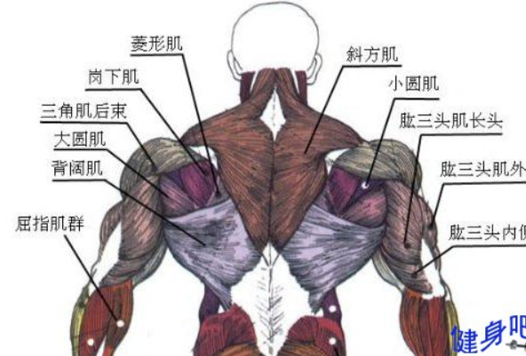

从解剖学上来看，背部肌肉形成从皮肤延申至脊柱的分层功能群组，单从健身角度看，往往只关注浅层的背部肌肉，比如斜方肌、背阔肌、大圆肌、大菱形肌、小菱形肌。  
  
一般而言，斜方肌还会分为上斜方肌、中斜方肌和下斜方肌。斜方肌在日常生活中的存在感其实比较强，这是因为其主要起到稳定肩胛骨、控制肩颈活动、参与上肢动作，在电脑前久坐、长时间伸头看手机这种现代人常见的习惯很容易导致斜方肌的紧张和不适。  
在目前的健身的审美观念中，往往不希望上斜方肌过于发达，因为过于发达的上斜方肌在缺少发达的三角肌中束搭配的情况下，会在视觉上导致窄肩。  
然而除了平时的不良习惯之外，在健身过程中很多动作也容易导致斜方肌代偿发力，从而无意中强化训练了斜方肌。  
