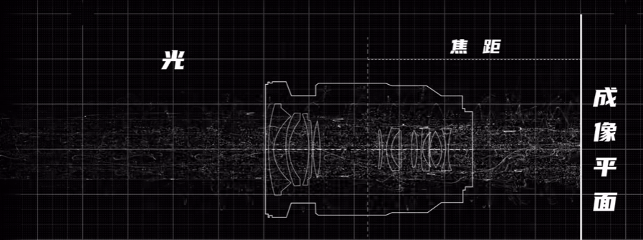
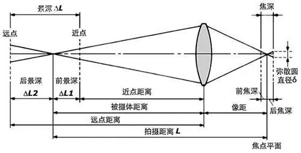
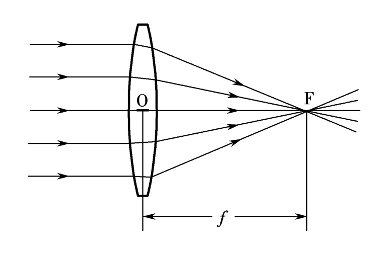
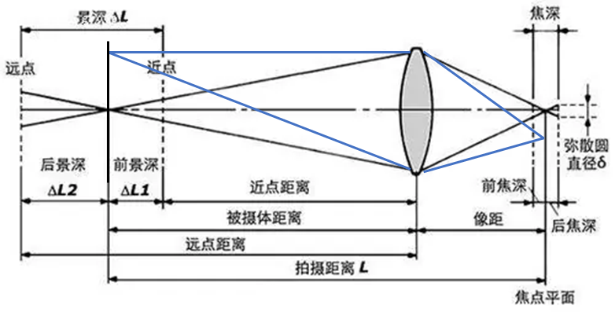
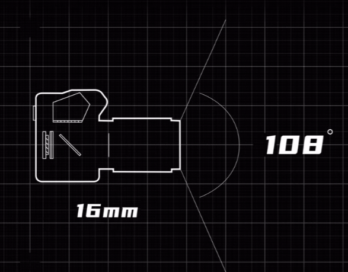
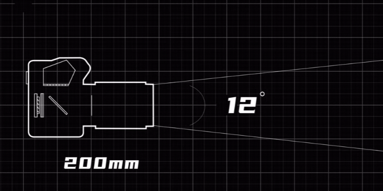

## 焦距定义   
*如何理解镜头焦距。*   

   

对于焦距的定义，摄影行业和光学上严格的定义存在差异，但都是用来描述透镜对于光的折射作用的一个参数。在摄影的相关语境中，焦距是**镜头光学中心到成像平面的距离**（苹果手机的标准镜头是26mm，但实际上手机的厚度也就10+mm，因此光学中心可能并不一定在镜头内部）。一般来讲，焦距越长，就能够拍得清楚越远处的物体，也就是拍摄主体越远。当拿着一个短焦的镜头去拍摄一个很远的物体的时候，此时实际上拍摄的主体并不是远处的物体，而是镜头和物体中间某个位置的空气。 

   
简单地使用一个透镜的情况定性地理解一下：当一个透镜在物理上确定之后，只有对焦平面上的点发出的光，经过透镜后会在焦点平面上汇聚成一个点，也就是如图的点可以汇聚成。而如上图中近点处的这个距离的平面上的点，发出的光线也会在某个距离汇聚成一个点，但是不在焦点平面上，从而导致其在焦点平面上的成像模糊。  
**所以在镜头确定了的情况下，要拍清楚一个物体，就需要调整物像距离实现对焦**，这个对焦的过程不仅仅可以由拍摄者通过移动改变与被摄物体的距离，也可以通过镜头内部移动整个透镜组的位置来改变物像距离，一般认为对焦的过程中焦距是不变的（也就是透镜的物理组成是不变的）。 

容易跟上面这幅图混淆的是下面的这副在初中物理中定义焦距的示意图。  
直觉上矛盾点就在于透镜最上方的光线和上图所示的点光源情况中入射到透镜最上方的光线，一条是平行于水平面的光线，另一条是与水平线呈角度的光线，两条光线以不同角度入射凸透镜的同一个点，那么出射光路必然不同。  
因此，假设上下两幅图中的两个透镜是同一个透镜（物理参数完全相同），则这两幅图中在透镜之后的聚焦的点并不是同一个点，并且从理论上来讲上图的焦点应该比下图的点更远。这就是为什么说摄影上的焦距和光学上的焦距不是同一个概念。  
具体来讲，下图所展示的是所有光线都平行于水平线的情况，如果是将光学传感器放在下图的聚焦的点处，那么很容易导致光学传感器被聚集的能量烧毁。  

在摄影语境下，镜头前的某一个平面由无数个点组成，每一个点都是一个点光源，其发射出的一部分光线会被凸透镜汇聚。而在如下图所示的被摄体距离处的平面上的所有点光源，其发射出并经过凸透镜的光线正好也可以汇聚成一个点，且这些点也在一个平面上，从而在这个平面上呈现出一个比较清晰的像。

## 焦距与视角
在摄影中，有一句话是：焦距决定视角。  
**理解视角可以从近景（前景）和远景（背景）出发**。在拍摄画面中，除了拍摄主体，还有近景物体和远景物体，而视角就是描述了**所能观察到的前后景的宽广程度**。

  

## 透视关系
焦距还会影响画面中的透视关系。  
从拍摄的角度来看，通过焦距的改变从而设置画面的透视关系是一种常见的手法。  
透视关系简单理解就是画面中的前、后景与被摄主体之间的相对大小，而这种相对大小为平面上的照片营造出了立体感和纵深感。  
焦距影响透视关系的规律大致如下：在同一幅景别中，使用的焦距越长，被摄主体与背景之间的距离就被压缩，看起来就越近。实际上一副图中这本质上也是反映了镜头之外的一些信息：被摄主体和背景之间的距离看起来小，意味着被摄物体与镜头之间的距离比较远。   
在视频拍摄中，有一种手法叫希区柯克变焦，就是在拍摄过程中连续改变焦距和以及拍摄物距，从而保持持续对焦于同一个被摄物体上，但是焦距的连续持续改变透视关系，从而在被摄物体的构图不变的情况下产生背景被拉伸的视觉效果，这种手法初次用于希区柯克导演的电影中。实现希区柯克效果还需要后期进行缩放裁切，从而保持这个过程中被摄物体和画框的大小比例不变。  
而实际上这应该也可以用来解释在不同焦段下的拍出的人脸存在差别的原因：如果在正面照中将鼻子作为被摄平面，那么可以将耳朵处的平面视为背景，则不同焦段下拍摄出来的两者之间在视觉上的距离就会不同，从而形成镜头畸变效应。因此如果要让照片尽可能贴近日常社交中他者视角的长相，基本上就应该选择在将镜头放在日常社交距离，然后对焦拍摄。  

