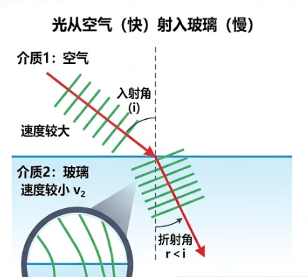
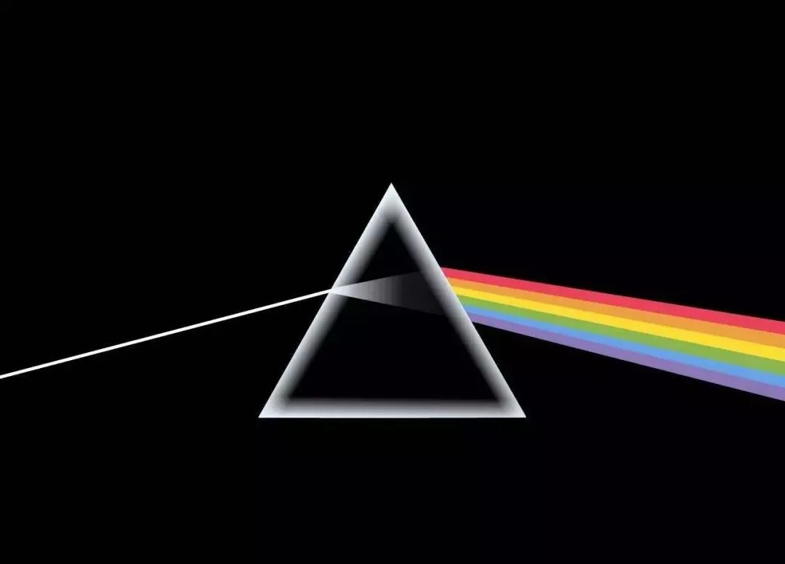

眼镜镜片是普通人在日常生活中能够接触到的光学器件之一。摄像机的镜头成像原理和眼睛成像原理相似，都可以抽象为凸透镜模型（将尺寸比较大的物体的光线会聚起来，从而在凸透镜的另一侧形成一个等比例缩小的虚像），所以对于摄像机镜头[焦距](../焦距/镜头焦距.md)的相关理解同样适用于眼睛，而近视眼镜则可以抽象为凹透镜。    
# 折射率
选购眼镜镜片时一个普通消费者可以经常接触并且有选择权的参数是折射率。折射率的定义是：光在真空中传播速度与光在镜片材料中的传播速度之比。光之所以会发生折射，就是因为光在不同介质中的传播速度不同。  
> 要理解光波的不同传播速度导致了光的折射，就不能将光看成直线模型，而应该以波动模型看待光。将光看成如下图所示的垂直于光传播方向的一道道波（绿线，也叫波前），由于是斜着入射，同一道波前一部分先接触玻璃，速度变慢（波长变短），而仍然在空气中的部分速度不变，正是这种差异导致了传播速度向着法线靠拢。**折射角的计算公式为$sin \theta_2 = \frac{n_1}{n_2} sin \theta _1$，这个速度差越大，则$n_2$越大，则$sin \theta_2$越小，则折射角$\theta_2$越小，发生的折射程度越大**，而这个规律也就影响了对于眼镜镜片的选择。 
> 以近视眼镜镜片为例，眼镜晶状体可以抽象理解为凸透镜，而近视则是凸透镜汇聚光线的能力变强，成像平面落在了视网膜的前方。而近视眼镜其实就是凹透镜，在光线到达眼镜之前将光线发散，从而抵消汇聚一部分眼睛的汇聚能力。而近视度数越深，需要镜片对光线的发散能力就越强。一种方法是让眼镜的表面曲率增加（即增大法线与光轴的角度），另一种方法就是增加折射率。曲率增加意味着眼镜越来越厚，因此度数太高时，就应该考虑高折射率的材料。  
  

市面上的树脂材质的眼镜镜片的折射率通常有1.50、1.56、1.60、1.67、1.71、1.74，更高的折射率则需要使用玻璃镜片。   
通常根据度数选取折射率：    

| 度数       | 建议折射率 |
| -------- | ----- |
| 0-200    | 1.50  |
| 0-400    | 1.56  |
| 400-600  | 1.60  |
| 600-1000 | 1.67  |
| 800-1200 | 1.71  |
| 1000+    | 1.74  |

# 阿贝数
阿贝数是选购眼镜的另一个常见的参数，跟折射率是息息相关的。在著名的棱镜色散实验中，由于不同波长的光在材料中的折射率不同，因此在棱镜内部白光中的不同波长的成分分离，也就是发生色散。而阿贝数就是用来衡量透明材料的色散程度的指标，阿贝数越高，色散现象越轻。眼镜镜片发生色散现象表现为成像不够清晰锐利，物体边缘可能出现彩色镶边。      
   
通过对[折射率](#折射率)的了解，可以知道越大的折射率使得光线的偏转越明显，而可以有这样一种直觉：越大的折射率同时也扩大了不同波长之间折射程度的差异。因此一般而言，折射率越大的镜片，阿贝数越低，但是也并非绝对，在折射率相同的情况下，尽量选择高阿贝数的镜片。  
选择镜片是一项系统工程，这也是为什么上面选择折射率的经验中，并没有建议低度数的人群选择高折射率的镜片，虽然低度数也可以选择高折射率的眼镜，这会使得眼镜厚度下降，眼镜变轻，但是高折射率的眼镜往往阿贝数比较低，会造成色散，而低度数的眼镜即便选择低折射率的材料，重量也不会明显成为负担，因此一般选择低折射率的材料。  
**阿贝数低于30的眼镜是不能上市的。**  
目前市面上常见的镜片材料参数如下：   

| 折射率  | 阿贝数 | 适合度数 | 备注                                             |
| ---- | --- | ---- | ---------------------------------------------- |
| 1.50 | 58  |      | 很高的阿贝数，接近角膜阿贝数，但是镜片很厚，很多都是球面镜片                 |
| 1.56 | 34  |      | 比较低                                            |
| 1.60 | 40  |      | 比如**明月1.60MR-8是40，依视路1.60是40.1，蔡司新清锐40.5比较推荐** |
| 1.67 | 32  |      | 比较薄，但是阿贝数比较低                                   |
| 1.71 | 37  |      | 高折，**但是阿贝数高，好材料，-3.00到-9.00都可以考虑**             |
| 1.74 | 33  |      | 很薄，阿贝数偏低,但是比1.67各方面都要更好，-6.00以上可以考虑            |
