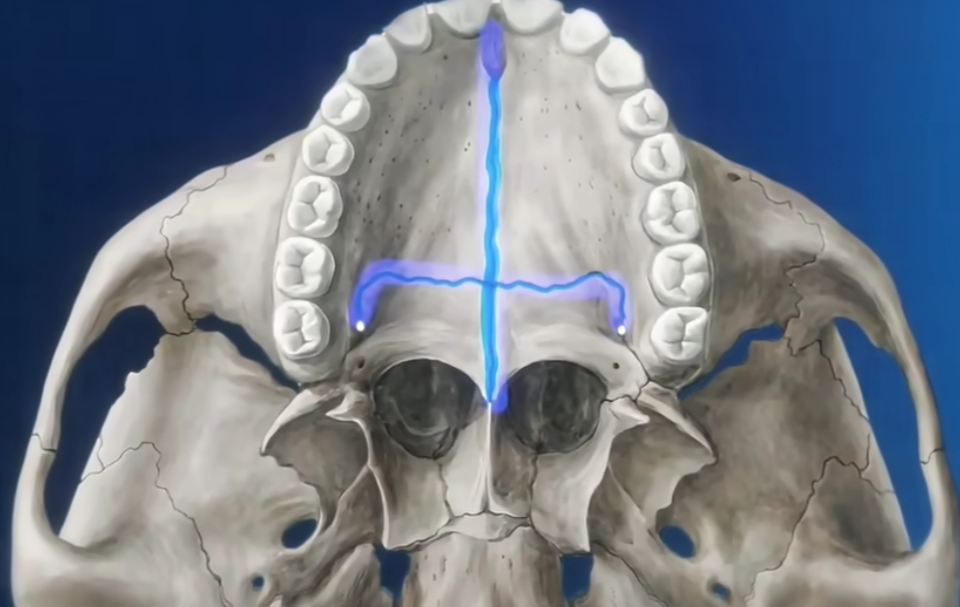
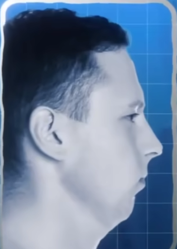
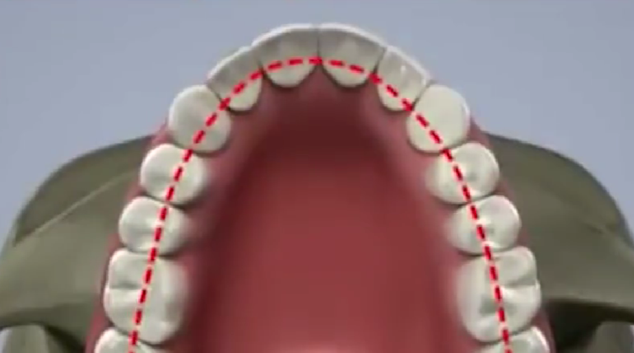
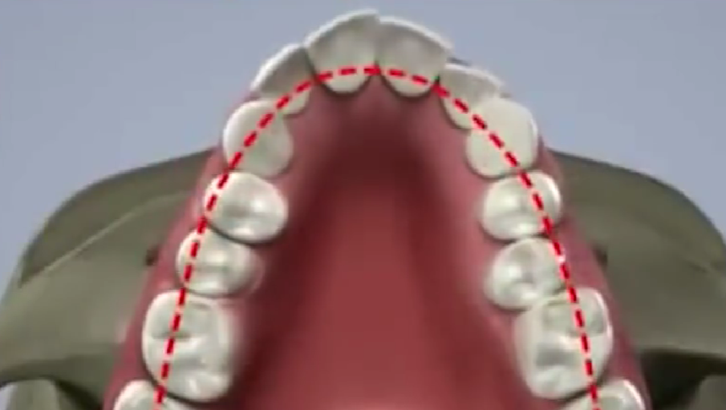
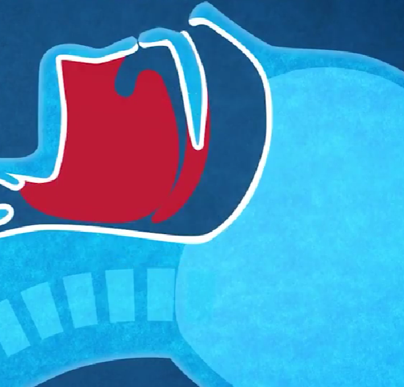
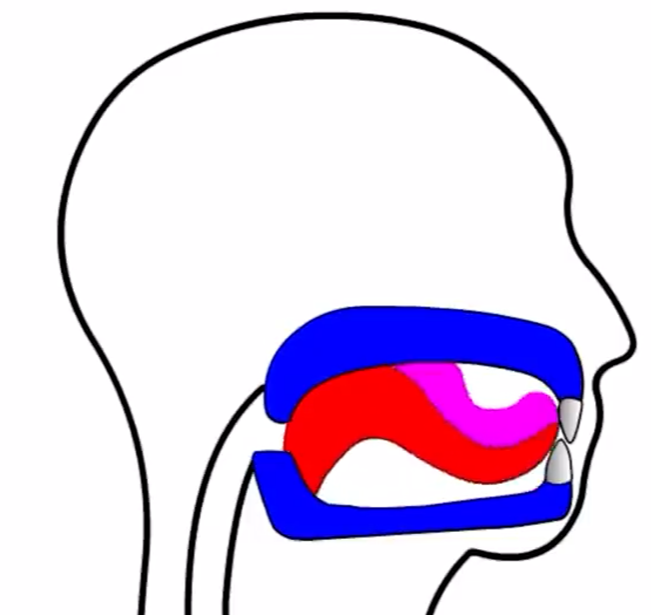
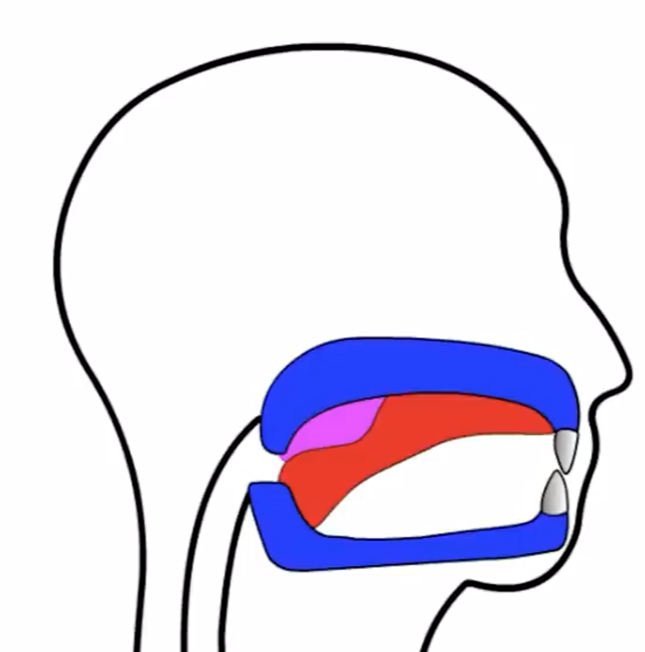
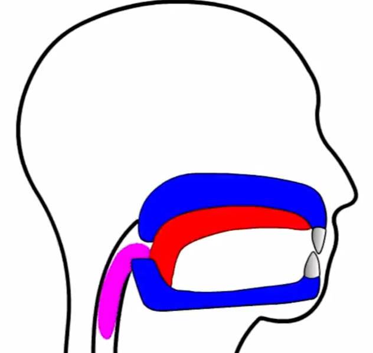

Mewing是一种口腔姿势训练方法，1970年左右由英国正畸医生Mew博士提出。  
该方法的具体实践简单来说就是持续保持舌头紧贴上颚。  

   
   
发明者的理论是这样能够通过舌头温和地刺激上颚的骨缝，这些骨缝在人的一生中都有一定的可塑性，从而使上颌骨变宽（这也是这个方法争议所在，实际上目前并没有严格的科学实验证明这种方法的有效性，但是目前互联网上确实可以看到部分实践者证实其有效性）。   

在西方目前的主流审美中，颧骨更高、下颌更清晰（这里的下颌更清晰参考好莱坞明星布拉德皮特）更好看。   
如果将下颌生长方向分为向前和向下两个方向，Mewing法的理论认为这种方式能够给脸部一个向前生长的信号（上下颌骨一起向前）。其思想实际上默认了下颌更容易向下生长。
    
上图展示的是一个典型的下巴后缩，整体来看是下颌骨发育不足导致的。下颌骨的整体发育不足是主要的原因，也就是说如果其下颌骨沿着目前的角度延申出一个尖翘的下巴。但是mewing法能否刺激下颌骨整体的发育是一个比较大的疑问。    
其次也确实可以发现，其下颌角较大，即从侧面看下颌线向下的分量大于向前的分量。如果让其下颌骨以下颌角处作为支点，向上旋转，可以在一定程度上使下巴和脖子分离，从而使得下颌线变得清晰。  
除了刺激下颌骨向前发育，正确的舌头的位置其他作用：   
1. 支撑牙弓
   
   
有舌头的支撑，面中部可以发育得更加宽阔，并且可以预防出现上图中的上牙弓收窄同时牙齿突出的情况（这种情况典型的一种就是所谓的腺样体面容）。  
2. 防止呼吸道收窄
   
舌头位置下降会导致向后移动，从而占据气道的部分空间，这种气道变窄影响呼吸功能可能会导致夜间打鼾、呼吸睡眠障碍等症状。  
3. 协助吞咽
舌头的位置贴近上颚是有助于推动食物向食道的过程的。  
  
  
  
上面三副过程图可以明显地观察到紧贴上颚的舌头（红色）对于食物（粉红色）的推动作用，如果舌头上抬紧贴上颚，就会需要其他肌肉来辅助吞咽过程。  

可以看出，正确的舌肌位置其实更加直接影响的是呼吸道方面的功能，而至于上下颌骨矫正，可能只能对于某一部分人有效（特别对于成年人的颌骨发育较缓慢），这也是为什么Mewing法用于改善脸型存在争议的原因。  

如何矫正舌头的摆放位置呢？  
一种比较好执行的方法是将舌尖贴紧上颚前端，然后进行吞咽，从而在内部形成真空。  
